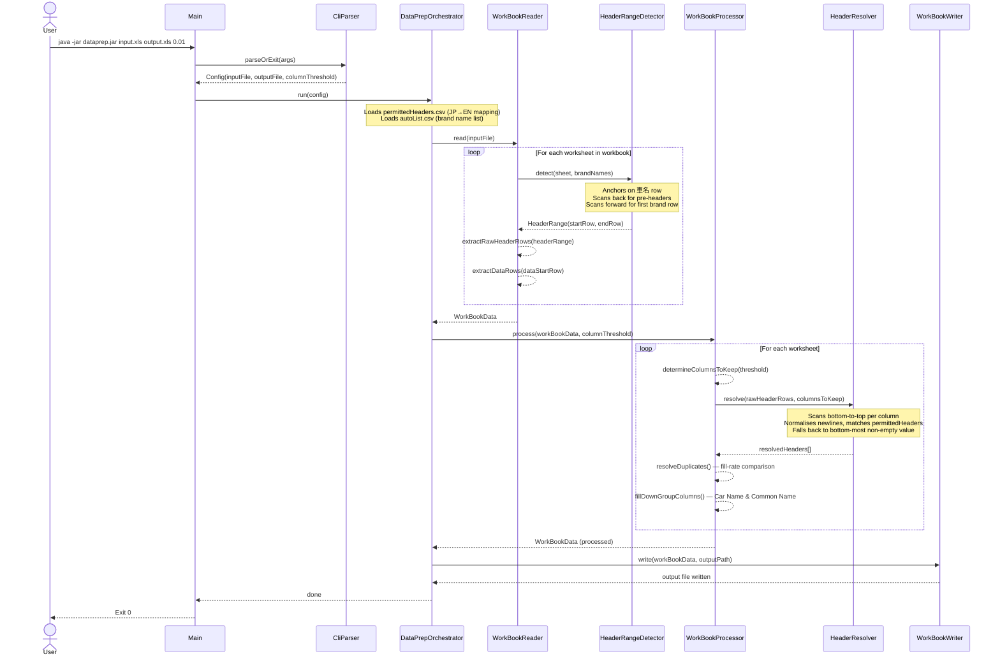

# DataPrep

A lightweight Java CLI tool that pre-processes XLS files produced by Japan's Ministry of Land, Infrastructure, Transport and Tourism (MLIT) fuel economy database. It normalises messy multi-row headers, removes sparse columns, and writes a clean single-header-row XLS ready to be consumed by the [spec-extractor](https://github.com/DylanBrennan92/spec-extractor) application.

## How It Works

The pipeline runs in four stages:

1. **Read** — `WorkBookReader` opens the XLS workbook, detects the multi-row header range per sheet (anchored to `車名`), and reads all data rows into memory.
2. **Process** — `WorkBookProcessor` drops columns below the fill threshold, resolves the multi-row headers into a single English label using `permittedHeaders.csv`, and removes or deduplicates any remaining duplicate columns using fill-rate comparison.
3. **Write** — `WorkBookWriter` writes the cleaned workbook (one header row + data rows per sheet) to the output path.
4. **Orchestrate** — `DataPrepOrchestrator` wires all three stages together; `Main` simply parses CLI args and calls it.

### Pipeline Sequence Diagram

> Mermaid source and draw.io import instructions: [`src/main/resources/diagrams/dataprep-pipeline.md`](src/main/resources/diagrams/dataprep-pipeline.md)



## Project Structure

```
DataPrep/
├── src/main/java/…/
│   ├── config/          # CLI parsing, Config record, constants, CSV loaders
│   ├── model/           # Data models: WorkBookData, WorkSheetData, RowData, CarBrand
│   ├── orchestration/   # DataPrepOrchestrator — pipeline entry point
│   ├── processor/       # WorkBookProcessor, HeaderResolver
│   ├── reader/          # WorkBookReader, HeaderRangeDetector, HeaderRange
│   └── writer/          # WorkBookWriter
└── src/main/resources/
    ├── diagrams/
    │   └── dataprep-pipeline.md   # Mermaid sequence diagram + draw.io import guide
    ├── local-data/
    │   ├── *.xls                  # Input files (not committed)
    │   ├── output/                # Generated output files (git-ignored)
    │   ├── permittedHeaders.csv   # Japanese → English header mapping
    │   └── autoList.csv           # Canonical Japanese car brand names
    └── logback.xml
```

## Technology Stack

| Library | Version | Purpose |
|---|---|---|
| Java | 21 | Records, pattern matching, text blocks |
| Apache POI | 5.4.0 | XLS parsing and writing |
| Lombok | 1.18.30 | `@Slf4j`, `@Data` — reduced boilerplate |
| SLF4J + Logback | 2.0.9 / 1.4.14 | Coloured console logging |
| Maven | — | Build and dependency management |

## Prerequisites

- Java 21+
- Maven 3.8+

## Building

```bash
git clone https://github.com/DylanBrennan92/DataPrep
cd DataPrep
mvn clean package
```

The runnable fat-JAR is produced at `target/dataprep-1.0-SNAPSHOT-jar-with-dependencies.jar`.

## Running

```bash
java -jar target/dataprep-1.0-SNAPSHOT-jar-with-dependencies.jar \
  <inputFile.xls> <outputFile.xls> <columnThreshold>
```

All three arguments are **required**.

### Arguments

| Argument | Description |
|---|---|
| `inputFile.xls` | Path to the source `.xls` file |
| `outputFile.xls` | Path where the processed `.xls` file will be written (output directory is created automatically) |
| `columnThreshold` | Minimum data fill ratio `0.0–1.0` to keep a column |

### Column Threshold Guide

| Value | Effect |
|---|---|
| `0.01` | Keep any column with at least 1% fill — recommended for most inputs |
| `0.05` | Keep columns with ≥ 5% fill — removes very sparse annotation columns |
| `0.10` | Keep columns with ≥ 10% fill — more aggressive; may drop sparse-but-valid columns like Car Name |

> The **Car Name** (`車名`) column is always kept regardless of the threshold.

### Example

```bash
java -jar target/dataprep-1.0-SNAPSHOT-jar-with-dependencies.jar \
  src/main/resources/local-data/5.1.Gzyouyou_WLTC.xls \
  src/main/resources/local-data/output/5.1.Gzyouyou_WLTC_output.xls \
  0.01
```

### Debug Logging

```bash
java -DLOG_LEVEL=DEBUG -jar target/dataprep-1.0-SNAPSHOT-jar-with-dependencies.jar \
  src/main/resources/local-data/5.1.Gzyouyou_WLTC.xls \
  src/main/resources/local-data/output/5.1.Gzyouyou_WLTC_output.xls \
  0.01
```

## Configuration Files

### `src/main/resources/local-data/permittedHeaders.csv`

Maps Japanese column headers from the source XLS to English output labels. Add a new row whenever a header label in the source file is not being resolved (a `WARN` log is emitted for unmatched labels).

```csv
japanese,english
車名,Car Name
通称名,Common Name
型式,Model Type
...
```

### `src/main/resources/local-data/autoList.csv`

Contains the canonical list of Japanese car brand names (e.g. `トヨタ`, `ホンダ`). This is used by `HeaderRangeDetector` to identify where header rows end and data rows begin.

```csv
brand,english
トヨタ,Toyota
ホンダ,Honda
...
```
