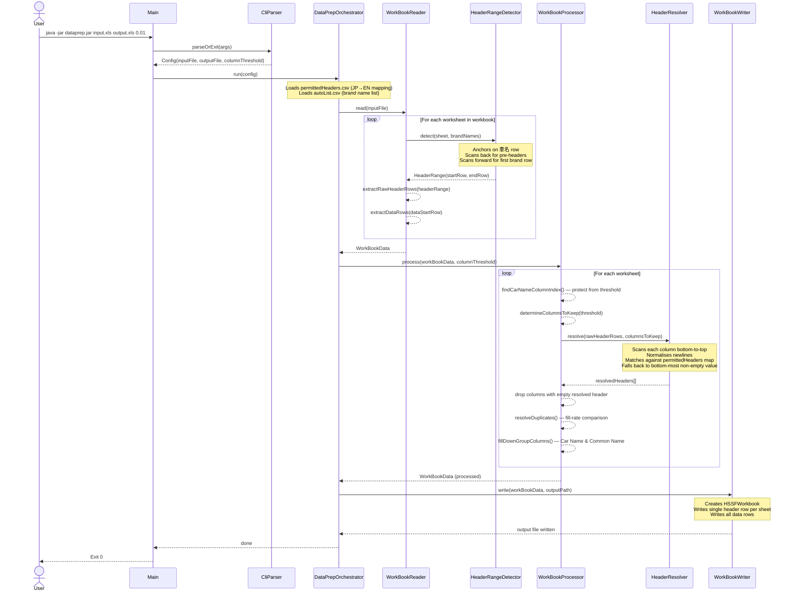

# DataPrep Pipeline — Sequence Diagram

## How to import into draw.io

1. Open [draw.io](https://app.diagrams.net/) (or the desktop app)
2. Go to **Extras → Edit Diagram**
3. In the format dropdown at the top of the dialog, select **Mermaid**
4. Paste the Mermaid block below (everything inside the triple backticks) and click **OK**

The diagram will be converted into a fully editable draw.io diagram that you can restyle, export as SVG/PNG, or embed in Confluence/Notion.

---

## Mermaid source

